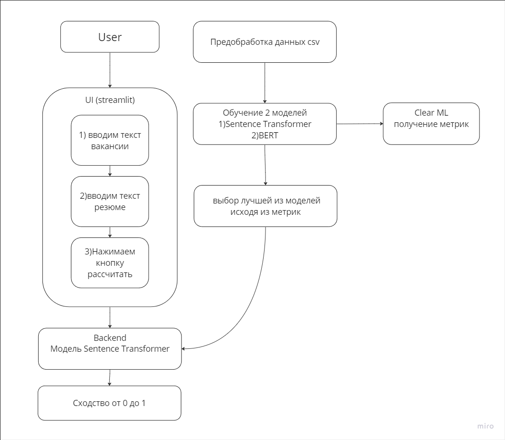

# Проект-кейс №2 по глубокому обучение на практике от **команды 9** - <aside>💡 **Матчинг описания вакансий и резюме**</aside>

## Пример работы

### Формализация задачи

Цель: Создать систему, способную точно оценивать совместимость резюме кандидата и описания вакансии, выраженную численным значением.

### Поиск датасета

Задача: Найти и собрать обширный датасет, включающий в себя описания вакансий и резюме, для обучения и тестирования модели. Использовать следующие ресурсы:

1. Открытые данные "Работа России": База данных с вакансиями и требованиями.
2. Датасет резюме с HeadHunter: Коллекция резюме от соискателей.
3. Дамп ODS: Данные о вакансиях и резюме до 02.2022 года.

### Формулировка задачи в ML терминах

Метрики:
- Точность (Precision): доля релевантных рекомендаций среди всех предоставленных.
- Полнота (Recall): доля релевантных рекомендаций, найденная моделью.
- F1-мера: Сбалансированная метрика для оценки точности и полноты.

Архитектуры:
- Sentence Transformer: для сравнения двух входных последовательностей и оценки их сходства.
- BERT: для извлечения семантических особенностей из текстов резюме и вакансий.

### Архитектура решения

1. Пользовательский интерфейс (UI) для загрузки резюме и выбора вакансии.
2. Back-end сервис, который обрабатывает введенные данные и взаимодействует с моделью машинного обучения.
3. Модель глубокого обучения, которая получает текст резюме и описание вакансии, анализирует их и выдает оценку релевантности.
4. База данных с информацией о вакансиях и резюме для обучения и тестирования модели.

### Выбор моделей для экспериментов

Мы будем экспериментировать с несколькими технологиями, чтобы выбрать наилучшую подходящую модель:

1. BERT: Для извлечения семантического содержания из текстов.
2. Sentence Transformer: Для сравнения семантической близости между резюме и описанием вакансии.

# Metrics Comparison

| Model                | Accuracy | F1 Score | Precision | Recall |
|----------------------|----------|----------|-----------|--------|
| Sentence Transformer | 0.63     | 0.78     | 0.72      | 0.98   |
| BERT                 | 0.55     | 0.70     | 0.68      | 0.73   |

